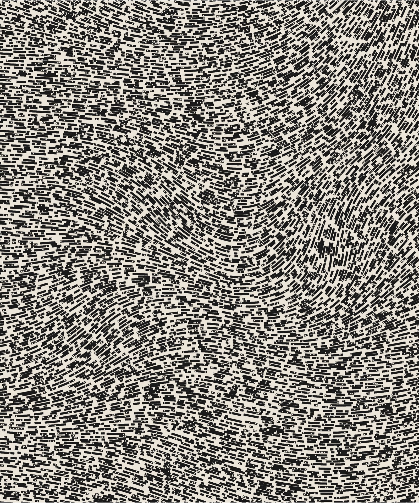
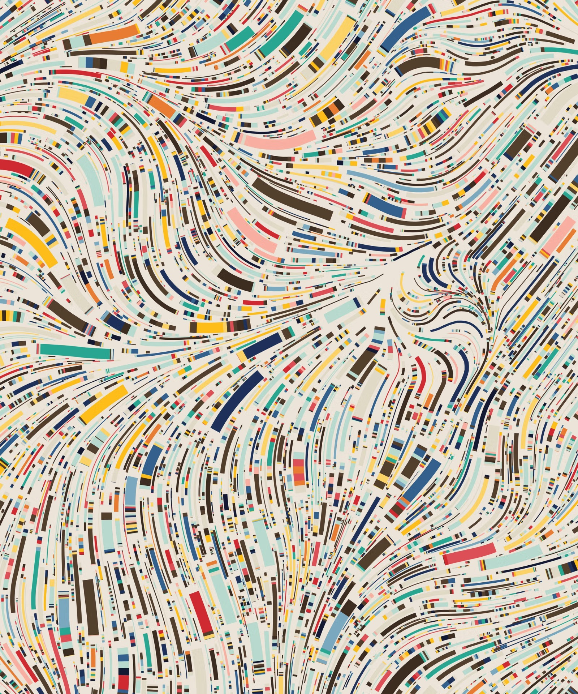
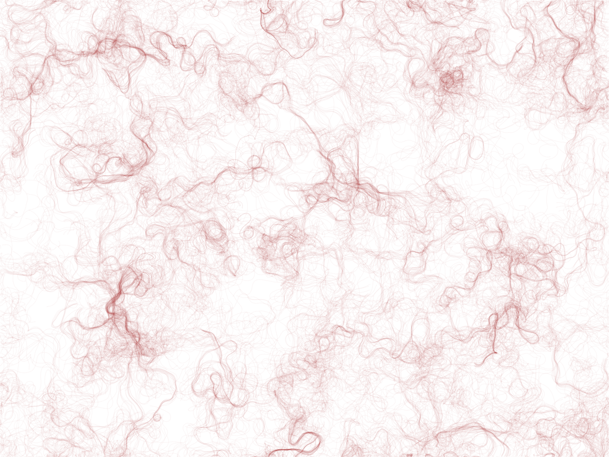

# Quiz 8: Design Research

## Part 1: Imaging Technique Inspiration

**Reference: *Fidenza* by Tyler Hobbs (2021)**

*Fidenza* is a generative art series by Tyler Hobbs. It uses a flow field, which is an invisible grid of arrows that guides the direction of every shape on the canvas. The same algorithm can produce very different looking outputs, from black and white spirals to colourful curving ribbons. For my assignment, I want to borrow this idea of placing many small rectangles along curved paths instead of drawing solid lines. This creates a sense of movement while keeping each shape visible.

## Part 2: Coding Technique Exploration

**Technique: Perlin Noise Flow Field in p5.js**

A Perlin noise flow field is the coding technique behind *Fidenza*. The code creates a grid of arrows where each arrow points in a slightly different direction, decided by Perlin noise. Particles are then dropped onto the grid and follow the arrows, drawing smooth curves as they move. This works well for my project because the curves look organic rather than mechanical, and I can change the number of particles, their size, or their colour to get different results.

**Example implementation:** Daniel Shiffman, *Coding Challenge #24: Perlin Noise Flow Field*

- Tutorial and code: <https://thecodingtrain.com/challenges/24-perlin-noise-flow-field>
- Live example: <https://editor.p5js.org/codingtrain/sketches/vDcIAbfg7>

## References

- Hobbs, T. (2021). *Fidenza*. <https://www.tylerxhobbs.com/words/fidenza>
- Shiffman, D. (2016). *Coding Challenge #24: Perlin Noise Flow Field*. The Coding Train. <https://thecodingtrain.com/challenges/24-perlin-noise-flow-field>
